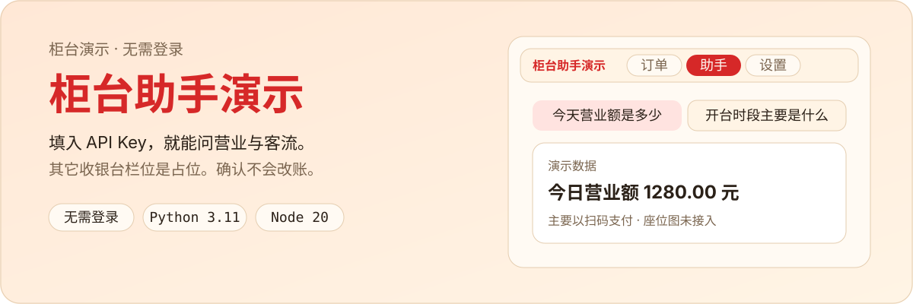
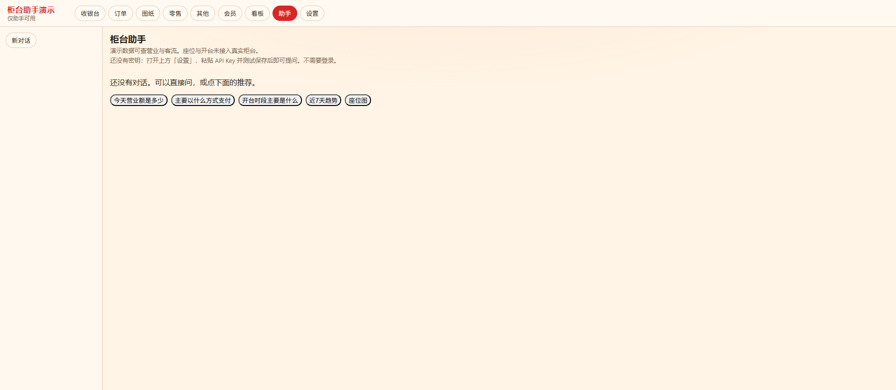
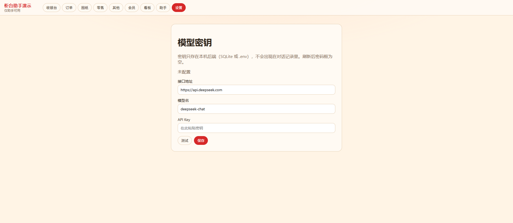
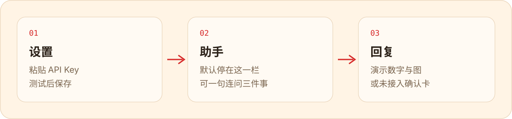

<p align="center">
  
</p>

填入 OpenAI 兼容密钥就能对话。页面默认停在**助手**；收银台、订单、图纸等栏位还在，但是占位。不需要登录。

<p align="center">
  
</p>

<p align="center">
  
</p>

这是一个可独立运行的演示壳。问营业、支付、客流会返回**演示数字**和图表。座位图是说明卡。开台 / 结算 / 改价只弹出确认卡外形，点确认也不会改账。

<p align="center">
  
</p>

<p align="center">
  
</p>

需要本机已装 Python 3.11+ 和 Node 20+。

```bash
# 仓库根目录
python -m venv .venv
# Windows: .venv\Scripts\activate
# macOS / Linux: source .venv/bin/activate
pip install -r backend/requirements.txt

# 终端 1
cd backend
python -m uvicorn app.main:app --reload --host 127.0.0.1 --port 8000

# 终端 2
cd frontend
npm install
npm run dev -- --host 127.0.0.1 --port 5173
```

打开 http://127.0.0.1:5173 → **设置** 粘贴 Key → 测试 → 保存 → **助手** 提问。

也可以把密钥写在仓库根目录的 `.env`（从 `.env.example` 复制）。不要提交 `.env` 或 `backend/data/*.sqlite`。

<p align="center">
  
</p>

| 可以 | 不要指望从本仓库得到 |
| --- | --- |
| 一句连问营业额、支付方式、开台时段 | 真实订单、结算、套餐改价 |
| 看趋势 / 客流 / 支付图（标明演示） | 店内座位坐标、选座表单 |
| 看到写入动作的确认卡外形 | 第三方核销、门店品牌图、课程提示词、API Key |

<p align="center">
  
</p>

实现 `backend/app/pos_port.py` 里的 `PosPort`，在 `backend/app/main.py` 换成你的适配器。演示用的是内存假数据 `DemoPosAdapter`。

## License

MIT
